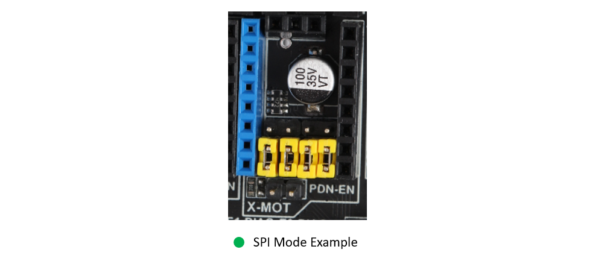
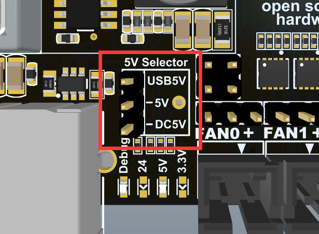
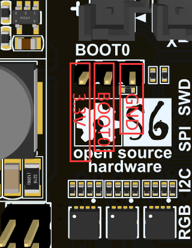
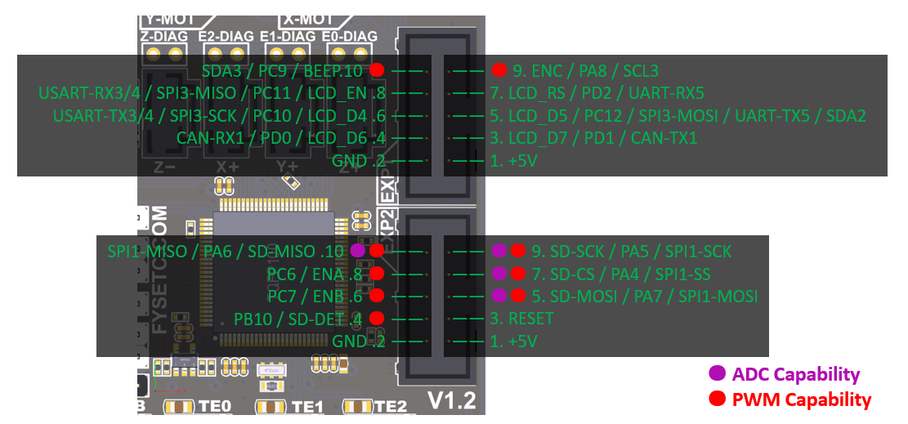
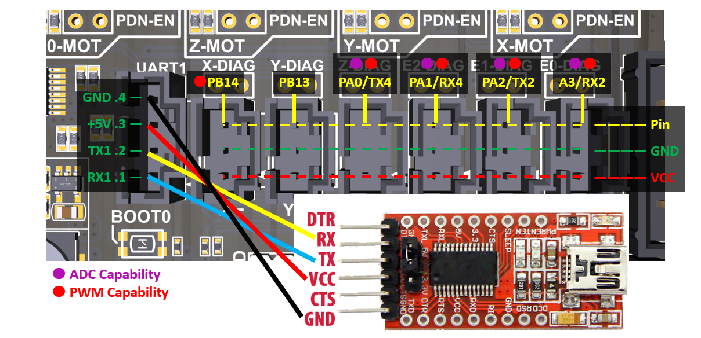
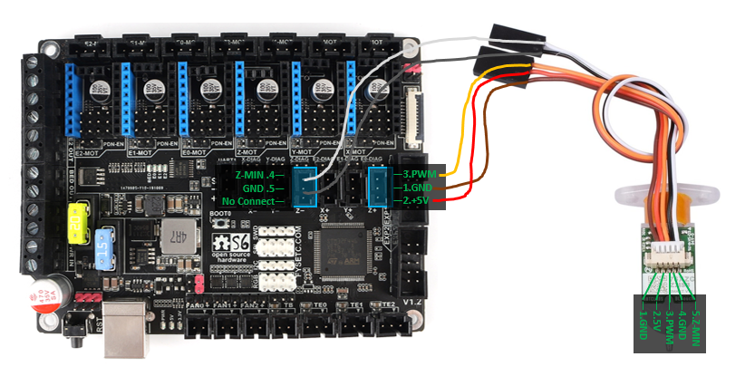
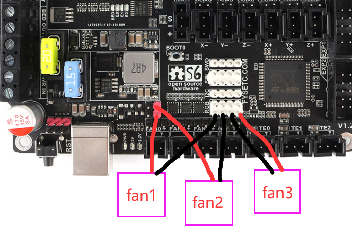

The S6 is based on the STM32F446 32bit mcu, like the F6, has six drive sockets and supports the full range of TMC drives. We have fully extended the resources of the MCU so that you can maximize its power. We considered the possible use scenarios of 3D printers and designed a series of extended applications, such as anti-reverse circuit, 12V power supply, thermocouple support, 24V sensor support and so on.

## 1. Features

- Compact size: 117mm x 87mm，Same as F6

- Based on STM32F446 180Mhz，all IOs can withstand 5V voltage

- 6 TMC stepper drivers support, no need wire Uart/SPI

- Improved TMC jumper settings ，simpler and easier to understand

- Main power reverse protection circuit，safer

- 28V input max，12V@5A，5V@2ADC-DC circuit，3.3V@0.6A LDO

- Two car fuses for hot bed input and main power input

- Limit switch socket 24V/5V/3.3V optional, ready for more other equipment, such as -inductive sensor, BL-Touch

- XH connector and MX connector are optional

- 10x PWM capable power mosfet outputs (1 for HotBed, 3 for Heat-End, 3 for fans, 3 for RGB LED strip) 

- 3pin temperature header, you can use thermistor or thermocouple (requires AD597 module)

- 3 ways PWM fans ，2 ways RGB led ，12V & 24V optional

- Easy DISPLAY + SD-CARD connector:
  
  - RepRapDiscount SmartController compatible pin header on board
  - 10P FPC for Serial Touch display
  - 2X4 PinHeader Out for SD Card moudle 
  - EXP1 & EXP2 have more multiplexing functions, such as USART, I2C, CAN

- SD card & USB upload support

## 2. Application

---

- 3D printer 

- CNC Device

- Other similar machines

## 3. Hardware

### 3.1 Reasources


| Board Name           | S6                                            | F6                                            |
| -------------------- | --------------------------------------------- | --------------------------------------------- |
| License              | GPL V2.0                                      | GPL V2.0                                      |
| Latest Version       | V1.2                                          | V1.4                                          |
| Extruders            | 3 Max                                         | 3 Max                                         |
| Fixed Fans           | 5 Max                                         | 5 Max                                         |
| Controlled Fans      | 3 Max                                         | 3 Max                                         |
| Heaters              | 3 Max                                         | 3 Max                                         |
| Endstops             | 6 Max                                         | 6 Max                                         |
| Temp sens            | 4 Max                                         | 4 Max                                         |
| SPI                  | 2 Max                                         | 1                                             |
| I2C                  | 3 Max                                         | 1                                             |
| ISP                  | --                                            | 1                                             |
| Serial port chip     | --                                            | CH340                                         |
| CPU                  | STM32F446VET6                                 | Atmega2560                                    |
| CPU Speed ( MHz )    | 180Mhz                                        | 16 Mhz                                        |
| Stepper driver       | 6 Max                                         | 6 Max                                         |
| Stepper driver  Type | All StepStick compatible modules              | All StepStick compatible modules              |
| Input                | Main PWR：12-24V 15A Max；BED IN：12-24V 20A Max | Main PWR：12-24V 10A Max；BED IN：12-24V 15A Max |
| Output               | BED OUT：20A Max ；Heater Out：5A Max            | BED OUT：15A Max ；Heater Out：5A Max            |

### 3.2 Jumpers

---

**Just like the F6 V1.4, the two Z-motor sockets are changed from parallel to series. If you only use one of the sockets, the other must be connected with a jumper cap, otherwise a Z-axis motor will not work.**


#### 3.2.1 Stepper drivers

In order to support as many different drivers as possible, S6 sets a lot of jumper positions. Different drive modules require different jumpers. As shown in the schematic diagram, there are 2 sets of jumpers in the drive section: JP1 and  JP6. 


In order to give you a better understanding of how to use jumpers for different drivers, I have further illustrated the driver socket. The basic definition of the driver pins is the same, the difference lies in the four places of JP6-1, JP6-2, JP6-3 and JP6-4. You can see their role from the schematic.


##### A4988 jumper config


- For A4988, A4988 similar, TMC2100 and TMC standalone Mode,  You need jumper JP6 (1234-5678) to config the micro-steps, and some TMC features.
- When you connect the jumper cap, this pin is high. When you are not connected, it is the level state of the module itself. This is different from F6, which can be either high or low.
- For details, please refer to the corresponding driver description.

##### UART mode config


- For TMC2208/2225/2209. You just need one jumper to close the JP1, Then the UART mode will enabled.
- You can config all the feature of  the TMC chip via UART, so you can leave all the other jumpers empty.
- Even for 2209, We give 2 lines UART interface to every driver, so no need config the address by MS1/MS2.

###### TMC2209 wiring


##### SPI mode config



- For TMC2130/5160/5161. You need 4 jumpers to close the JP6, Then the SPI mode will enabled.

#### 3.2.2 12V/24V jumpers


- S6 have 12V onboard, Fan and RGB jumpers can refer to this picture and the silk screen at the bottom of the board.
- The input power supply voltage should EXCEED 15v ,if not, the output voltage of 12V DCDC circuit will lower than 12v
- Never let the 12V current exceed 5A, otherwise it will burn out the 12V DCDC circuit.
- If you use an input above 18V, you will get a satisfactory 12V output, otherwise the output may be less than 12V.

#### 3.2.3 DIAG jumpers


- If you use a TMC driver with sensor-less homing(2130/2209/5160/5161), you can connect these jumpers so that the MCU can get the DIAG signal through the corresponding end-stop pin to achieve sensor-less.
- After connect the jumper, remember define the DIAG pins in the firmware and enable the feature.

#### 3.2.4 Bottom jumpers


- X+ / Y+ / Z+ , You can choose 5V or 3.3V, For X+ & Y+, the default is 3.3V. For Z+, The default is 5V, You can connect BLtouch here.

- X- / Y- / Z- , You can choose 24V or 3.3V, the default is 3.3V. You can switch to 24V, if you want to use some inductive or capacitive sensors.
  
  

- I2C pins, You can choose 5V or 3.3V, the default is 3.3V. 

- For TE0-TE2, You can cut the jumper if you want use a thermocouple temperature measurement through AD597.

#### 3.2.5 Jumper for 5V

S6 **V2.0** version adds 5V selection jumper. You can choose 5V from USB or DC circuit. 

Know issue: With 5V USB jumper selected, 24V applied, USB cable disconnected, the heater FETs will turn on.  So we recommend you to choose 5v from DC5V.



#### 3.2.6 Jumper for Boot0

In S6 V2.0, the BOOT0 button is replaced by a jumper.



### 3.3 Pin Definition

All the pins we have marked on the back of the board, if you need to, you can confirm the board in reverse or check the sch.

Thanks to the power of the STM32, each pin has multiple functions, I will identify it for your reference as much as possible. For further information, please refer to the STM32F446 datasheet, which I have placed on our [S6 GitHub](https://github.com/FYSETC/FYSETC-S6/blob/master/datasheet/stm32f446ve.pdf)

#### 3.3.1 EXP1&EXP2



#### 3.3.2 Eedstops and UART1 Pins

The UART socket next to the limit switch can be used to connect serial devices such as the wifi module, or to update the firmware through the serial port.



#### 3.3.3 BL-touch Wiring Example



#### 3.3.4 Reuse RGB ports for FAN



## 4. Firmware

---

### 4.1 Marlin

#### Download Vscode + platformio

To compile the firmware , you need to install Visual Studio Code and the platformio pulg-in.

#### Download firmware

##### S6 v1.2

The firmware is in the `firmware` folder in this repository, and if you want to know what we have changed , we recommend to use git to get the code .

If you want to have latest feature of Marlin , we recommend to use latest [Marlin bugfix-2.0.x branch](https://github.com/MarlinFirmware/Marlin/tree/bugfix-2.0.x) , after downloading ,you need to enable following define in ```configuration.h``` file  

```#define MOTHERBOARD BOARD_FYSETC_S6```

then change the ```default_envs``` variant in ```platformio.ini``` file

```defaultenvs = FYSETCS6``` (For old bootloader,boot address is `0x10000`, see below)

```defaultenvs = FYSETCS68000``` (For new bootloader,boot address is `0x8000`, see below)

**Note: The bootloader boot address have been change to `0x8000` since 2021/06/23, you can check bootloader details [here](https://github.com/FYSETC/FYSETC-S6/tree/main/bootloader), and you can check the Marlin PR [here](https://github.com/MarlinFirmware/Marlin/pull/22207).**

##### S6 v2.0

The firmware is in the `firmware` folder in this repository , you can also get the firmware from latest [Marlin bugfix-2.0.x branch](https://github.com/MarlinFirmware/Marlin/tree/bugfix-2.0.x). You need to enable following define in ```configuration.h``` file  

```#define MOTHERBOARD BOARD_FYSETC_S6_V2_0```

then change the ```default_envs``` variant in ```platformio.ini``` file

```defaultenvs = FYSETCS6``` (For old bootloader,boot address is `0x10000`, see below)

```defaultenvs = FYSETCS68000``` (For new bootloader,boot address is `0x8000`, see below)

**Note: The bootloader boot address have been change to `0x8000` since 2021/06/23, you can check bootloader details [here](https://github.com/FYSETC/FYSETC-S6/tree/main/bootloader), and you can check the Marlin PR [here](https://github.com/MarlinFirmware/Marlin/pull/22207).**

#### Compile the firmware

Open Vscode and open platformio main page and click the "Open Project" button , and direct to the folder where you put your firmware.


If everything goes fine , at the bottom you can see several buttons


The check mark is for compiling , click it to compile.

If you generate the hex file fail you may need to open vscode using Administrator Account .

### 4.2 Upload firmware

#### 4.2.1 Upload the firmware(SDCARD)

We provide several ways to upload the firmware .Uploading with SD card is our default way to update the firmware as the board already has the sdcard bootloader in it when it leave the factory. If you choose to upload the firmware with a sdcard. First you need to connect a sdcard module to the S6 EXP2 port. Basically , you can use any kind of LCD screen that contain sdcard module. But if you can't make it work , check if your sdcard module's SPI CS pin connected to PA4 pin in S6 board .

Then,copy your compiled firmware file ```firmware.bin``` file to the SD card , and insert it to the SD card module , and then power on the board. You may need to wait for about 30s to finish uploading. 

Note: The bootloader is in the folder named `bootloader`, please follow the README in [bootloader folder](https://github.com/FYSETC/FYSETC-S6/tree/main/bootloader).

#### 4.2.2 Upload the firmware(DFU)

The other way to upload the firmware is using DFU.

##### 1. Download stm32cubeprogrammer

You can download it from ST website.

https://www.st.com/zh/development-tools/stm32cubeprog.html

Open the STM32CubeProgrammer software.


##### 2. Enter DFU mode

S6 v1.2

First power off the board , then push the Boot0 button and hold it , then connect the USB to the board and your computer , it will enter DFU mode . Now you can loose you hand from Boot0 button.

S6 v2.0

First power off the board , then jumper the Boot0 to 3.3V , then connect the USB to the board and your computer , it will enter DFU mode . Now you can loose you hand from Boot0 button. 

***REMEMBER to remove the jumper if you finish uploading or it will enter DFU mode again.***

##### 3. Upload the firmware

Now you can connect and flash the S6 board with stm32cubeprogrammer with the following operation.


Do as the red number shows in the screen shot.

1. Click the button to flesh the DFU port.

2. Connect the DFU 

3. Choose the "firmware.bin" file.

4. fill in the 'Start address' with `0x8008000` (If your platformio env is `default_envs = FYSETC_S6`, then you need to set it to `0x8010000`, in klipper if your boot address is `32k` then set it `0x8008000`, if 64k , set it `0x8010000`)

5. Start Programming

**We will continue to update, please look forward to it!**

## 5. Tech Support

You can submit issue in our github https://github.com/FYSETC/FYSETC-S6/issues
Or submit any technical issue into our [forum](http://forum.fysetc.com/) 

## 6. Related Articles

[English](https://3dwork.io/en/fysetc-s6-complete-guide/)

[Español](https://3dwork.io/fysetc-s6-guia-completa/)
