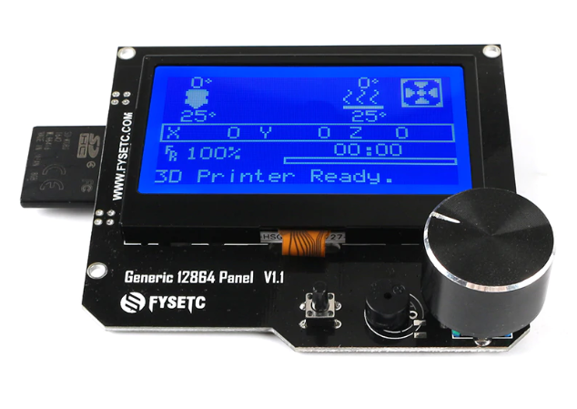
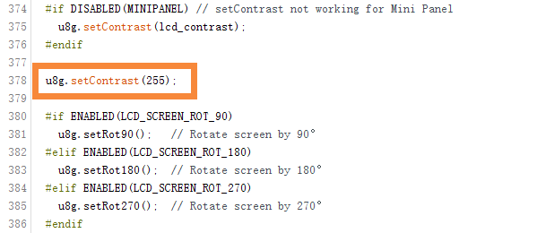
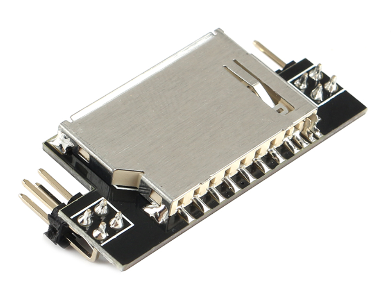

## Product Introduction




This is a opensouce, cheap, with RGB indicator, common to marlin's display, supports offline printing, resolution is 12864, display area is 3.2'', SD card holder can be side or vertical, Dimensional compatible with REPRAP_DISCOUNT_FULL_GRAPHIC_SMART_CONTROLLER, Software compatible with MINIPANEL in marlin firmware.

Available in a single backlight color version, also available in RGB backlight (NEOPIXEL_LED)version.Choose according to your preferences！

## Features

- 3.2" inch high contrast Graphic LCD,Dimensional compatible with REPRAP_DISCOUNT_FULL_GRAPHIC_SMART_CONTROLLER
- Black-gray/black-green/white-black/white-blue/green-black, 5 display styles
- SPI communication to host micro-controller
- Support Vertical or side SD slot with card detect,with a optional  SD module
- Software configurable contrast setting
- 3D printable case and mount STL file 
- Configurable RGB backlight, WS2811 single line control.
- Black background or transparent backgroun.
- The extra EXP3 is 1284P or a motherboard that requires a single display function.


## Application

3D printer，CNC machines ，Other micro controller projects


## Typical  Wiring


## Firmware config

This screen driver is ST7567 and is compatible with the marlin Mini panel (UC1701,same as ST7567). It has been tested well, and the following configuration is required.

**Before you start, please install the latest version of U8glib.**

##### Step1. changes the pins.

On a RAMPS-compatible board, you need to make the following changes in pins_RAMPS.h:

``` cpp tab='pins_RAMPS.h'
 #elif ENABLED(MINIPANEL)
      #define BEEPER_PIN 37
      // Pins for DOGM SPI LCD Support
      #define DOGLCD_A0  16
      #define DOGLCD_CS  17
      #define LCD_BACKLIGHT_PIN 27 // backlight LED on A11/D65
      #define LCD_RESET_PIN  23
      #define SDSS   53

      #define KILL_PIN -1
      #define LCD_CONTRAST 200
      #define BTN_EN1 31
      #define BTN_EN2 33
      #define BTN_ENC 35  //the click switch
    
      #define SD_DETECT_PIN 49
```

On a our F6 board, you need to make the following changes in pins_FYSETC_F6_V13.h:


``` cpp tab='pins_FYSETC_F6_V13.h'
//////////////////////////
// LCDs and Controllers //
//////////////////////////

    // #define LCD_PINS_RS         16
    // #define LCD_PINS_ENABLE     17
    // #define LCD_PINS_D4         23
    // #define LCD_PINS_D5         25
    // #define LCD_PINS_D6         27
    // #define LCD_PINS_D7         29
    
    // Pins for DOGM SPI LCD Support
    #define DOGLCD_A0  16
    #define DOGLCD_CS  17
    #define LCD_BACKLIGHT_PIN 27 
    #define LCD_RESET_PIN  23
    #define LCD_CONTRAST 200
    
    #define SDSS   53
    #define BEEPER_PIN          37
    #define BTN_EN1             31
    #define BTN_EN2             33
    #define BTN_ENC             35
    #define SD_DETECT_PIN       49
    #define KILL_PIN            -1
```
##### Step2. Config the configuration.h. 

In order to control RGB-LED, you also need to turn on the RGB control in marlin.

For RGB version:

You only need enable the NEOPIXEL_LED.

``` cpp tab='configration.h'
// Support for Adafruit Neopixel LED driver
/********** 1. only need enable the NEOPINEL_LED for mini12864 V2.1 **********/
#define NEOPIXEL_LED
#if ENABLED(NEOPIXEL_LED)
  #define NEOPIXEL_TYPE   NEO_GRBW // NEO_GRBW / NEO_GRB - four/three channel driver type (defined in Adafruit_NeoPixel.h)
  #define NEOPIXEL_PIN    27        // LED driving pin on motherboard 4 => D4 (EXP2-5 on Printrboard) / 30 => PC7 (EXP3-13 on Rumba)
  #define NEOPIXEL_PIXELS 1       // Number of LEDs in the strip
  #define NEOPIXEL_IS_SEQUENTIAL   // Sequential display for temperature change - LED by LED. Disable to change all LEDs at once.
  #define NEOPIXEL_BRIGHTNESS 127  // Initial brightness (0-255)
  //#define NEOPIXEL_STARTUP_TEST  // Cycle through colors at startup
#endif
```

##### Step3. Config the configuration_adv.h.

If you need to change the RGB-color manually,  then you need to enable the LED_CONTROL_MENU in configuration_adv.h. If you don't need it, you can skip this step.

``` cpp tab='configration_adv.h'
/**
 * LED Control Menu
 * Enable this feature to add LED Control to the LCD menu
 */
/********** 1. enable the LED_CONTROL_MENU RGB manual control **********/
#define LED_CONTROL_MENU
#if ENABLED(LED_CONTROL_MENU)
  #define LED_COLOR_PRESETS                 // Enable the Preset Color menu option
  #if ENABLED(LED_COLOR_PRESETS)
    #define LED_USER_PRESET_RED        255  // User defined RED value
    #define LED_USER_PRESET_GREEN      128  // User defined GREEN value
    #define LED_USER_PRESET_BLUE         0  // User defined BLUE value
    #define LED_USER_PRESET_WHITE      255  // User defined WHITE value
    #define LED_USER_PRESET_BRIGHTNESS 255  // User defined intensity
    //#define LED_USER_PRESET_STARTUP       // Have the printer display the user preset color on startup
  #endif
#endif // LED_CONTROL_MENU
```

##### Step4. add the codes in ultralcd_impl_DOGM.h.

You need to add a shorts codes to ultralcd_impl_DOGM.h, otherwise your screen may not have text displayed, or it may not be clear.
Add  "u8g.setContrast(255);" in the "static void lcd_implementation_init()" function:



## Optional Hardware module:

The SD card of mini12864 can be  set on the side or in the front,  which requires a module to implement. As shown below:



## Attention

-TBD-

## FAQ

-TBD-

## Attachments
### 1. Schematic

---------

You can find the schematics for the three versions on [github](https://github.com/FYSETC/Generic-12864-panel).


### 2. Dimensions

**For detailed dimensions please check dwg/step file on [github](https://github.com/FYSETC/Generic-12864-panel).**


## Shop

---
- [Gineric 12864_LCD]( https://www.aliexpress.com/item/33029483516.html )


## Tech Support

---
Please submit any technical issue into our [forum](http://forum.fysetc.com/) or [facebook](https://www.facebook.com/groups/197476557529090/).


