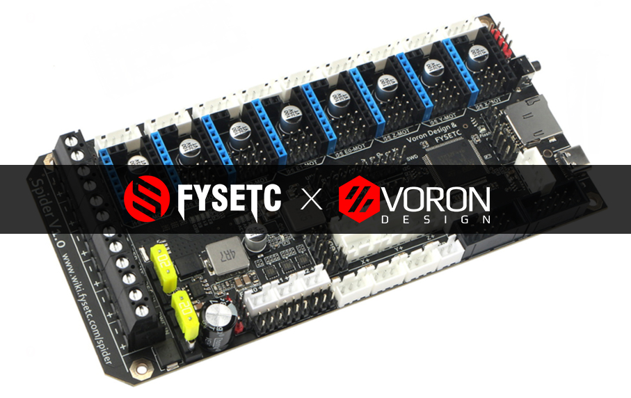
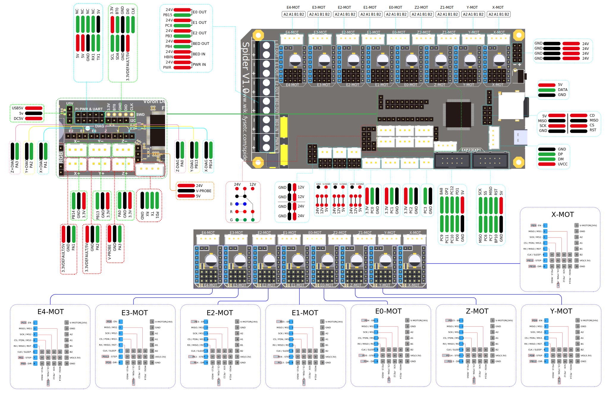
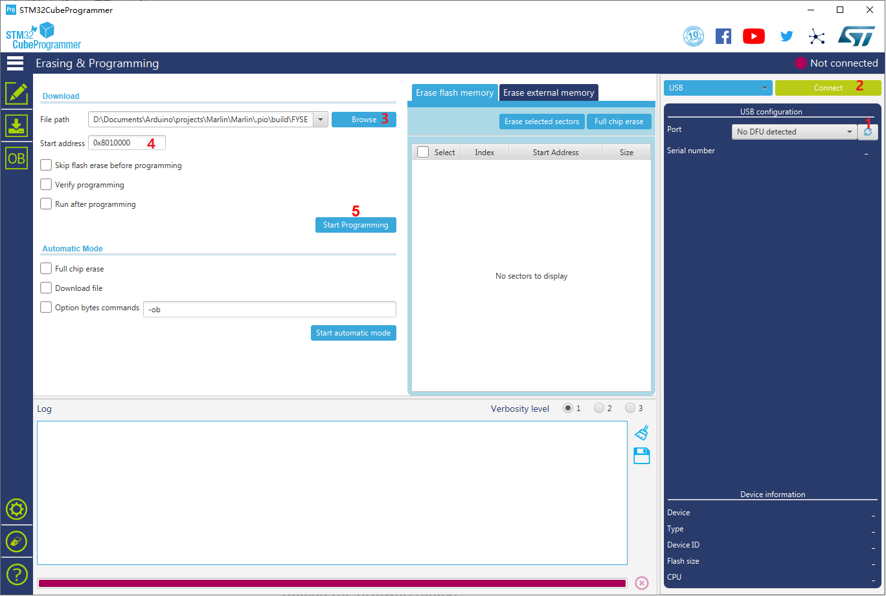

## 1. Product Introduction

SPIDER is a small but powerful 3D printer control board. In a limited space, it integrates 8 stepper motor drives, 5A 12V power supply, 8A 5V power supply, which provides powerful energy for fans of various voltages, various RGB light strips and Raspberry Pi.
You can build a 3D printer with rich functions through SPIDER. Especially for VORON V2.4, we cooperated with the VORON team in the early stage of design, and many features have been recognized by the VORON team. If you are building VORON, this will be your best choice.


## 2. Features

- Compact size: 155.3mm x 76.5mm
- **Based on STM32F446 180Mhz，all IOs can withstand 5V voltage**
- **8 TMC stepper** drivers support, with Uart&SPI support
- Improved TMC jumper settings again，simpler and easier 
- 28V input max，12V@5A DC-DC，**5V@8A DC-DC (Especially for Raspberry Pi)**，3.3V@0.8A LDO
- Two car fuses for hot bed input and main power input
- Limit switch socket 24V/5V/3.3V optional, ready for more other equipment, such as -inductive sensor, BL-Touch
- XH2.54 connectors
- 10x PWM capable power mosfet outputs (1 for HotBed, 3 for Heat-End, 3 for fans, 3 for RGB LED strip)
- 3pin temperature header, you can use thermistor or thermocouple (requires AD597 module)
- **Up to 8 ways PWM fans**  (only use 1 extrueder and no 12V/24V RGB used )，2 ways RGB led(12V & 24V optional) ，**1 way 5V-RGB led (NEO-PIXEL/WS2812)**
- RepRapDiscount SmartController compatible pin header on board
- **UART1-Raspberry Pi pin header (including 5V@8A power supply)**
- 2X4 PinHeader Out for SD Card moudle
- **Onboard micro-SD card**
- **Type-C and Type-B USB connector optional**
- EXP1 & EXP2 have more multiplexing functions, such as USART, I2C, CAN
- SD card & USB upload support
- A 4.7kOhm 0.1% temperature sensor pull up resistor is used, PT1000 can be connected directly. For PT100, an amplifier board must be used.
## 3. Haredware Guide

### 3.1 Wiring


### 3.2 Wiring : FYSETC mini 12864 v2.1 

####  注意/NOTICE

​    

   为了兼容某些主板，如RAMPS1.4，FYSETC mini12864 设置了 RST(R3) 和 KILL(R4) 的可选择电阻。目前，有些主板（S6/Spider）将 KILL 换成 5V，此时，请确认FYSETC mini12864 上 R4处于空贴状态，否则按下屏幕上的按钮会致使 5V 与 GND 短路，长时间操作会导致主板损坏。<br>   In order to be compatible with some motherboards, such as RAMPS1.4, mini12864 is equipped with RST (R3) and KILL (R4) optional resistors. At present, some motherboards (S6/Spider) change the KILL to 5V. At this time, please make sure that R4 is not on the mini12864 (please remove it if it is  on the board), otherwise pressing the button on the screen will cause a short circuit between 5V and GND, and long-term operation will cause the motherboard to be damaged.

  目前发现有些主板在接上 mini12864，并采用 USB 进行烧录时会导致无法烧录的情况，请去除 R1 10K 电阻。<br>At the moment , some Spider can't upload the firmware using USB if mini12864 is connected to the board, if you run into this issue, please remove R1  resistor.

### 3.3 Wiring : TMC2209

 

### 3.4 Pin Out



### 3.5 Pin Definition

<table>
   <tr><td>Features</td><td>Spider Pin</td><td>STM32 Pin</td><td>Pin No.</td><td>Comment</td></tr>
   <tr><td rowspan="4">X-MOTOR(1)</td><td>X-Step</td><td>PE11</td><td>42</td><td></td></tr>
   <tr><td>X-DIR</td><td>PE10</td><td>41</td><td></td></tr>
   <tr><td>X-EN</td><td>PE9</td><td>40</td><td></td></tr>
   <tr><td>X-CS/PDN</td><td>PE7</td><td>38</td><td></td></tr>
   <tr><td rowspan="4">Y-MOTOR(2)</td><td>Y-Step</td><td>PD8</td><td>55</td><td></td></tr>
   <tr><td>Y-DIR</td><td>PB12</td><td>51</td><td></td></tr>
   <tr><td>Y-EN</td><td>PD9</td><td>56</td><td></td></tr>
   <tr><td>Y-CS/PDN</td><td>PE15</td><td>46</td><td></td></tr>
   <tr><td rowspan="4">Z-MOTOR(3)</td><td>Z-Step</td><td>PD14</td><td>61</td><td></td></tr>
   <tr><td>Z-DIR</td><td>PD13</td><td>60</td><td></td></tr>
   <tr><td>Z-EN</td><td>PD15</td><td>62</td><td></td></tr>
   <tr><td>Z-CS/PDN</td><td>PD10</td><td>57</td><td></td></tr>
   <tr><td rowspan="4">E0-MOTOR(4)</td><td>E0-Step</td><td>PD5</td><td>86</td><td></td></tr>
   <tr><td>E0-DIR</td><td>PD6</td><td>87</td><td></td></tr>
   <tr><td>E0-EN</td><td>PD4</td><td>85</td><td></td></tr>
   <tr><td>E0-CS/PDN</td><td>PD7</td><td>88</td><td></td></tr>
   <tr><td rowspan="4">E1-MOTOR(5)</td><td>E1-Step</td><td>PE6</td><td>5</td><td></td></tr>
   <tr><td>E1-DIR</td><td>PC13</td><td>7</td><td></td></tr>
   <tr><td>E1-EN</td><td>PE5</td><td>4</td><td></td></tr>
   <tr><td>E1-CS/PDN</td><td>PC14</td><td>8</td><td></td></tr>
   <tr><td rowspan="4">E2-MOTOR(6)</td><td>E2-Step</td><td>PE2</td><td>1</td><td></td></tr>
   <tr><td>E2-DIR</td><td>PE4</td><td>3</td><td></td></tr>
   <tr><td>E2-EN</td><td>PE3</td><td>2</td><td></td></tr>
   <tr><td>E2-CS/PDN</td><td>PC15</td><td>9</td><td></td></tr>
   <tr><td rowspan="4">E3-MOTOR(7)</td><td>E3-Step</td><td>PD12</td><td>39</td><td></td></tr>
   <tr><td>E3-DIR</td><td>PC4</td><td>33</td><td></td></tr>
   <tr><td>E3-EN</td><td>PE8</td><td>59</td><td></td></tr>
   <tr><td>E3-CS/PDN</td><td>PA15</td><td>77</td><td></td></tr>
   <tr><td rowspan="4">E4-MOTOR(8)</td><td>E4-Step</td><td>PE1</td><td>34</td><td></td></tr>
   <tr><td>E4-DIR</td><td>PE0</td><td>97</td><td></td></tr>
   <tr><td>E4-EN</td><td>PC5</td><td>98</td><td></td></tr>
   <tr><td>E4-CS/PDN</td><td>PD11</td><td>58</td><td></td></tr>
   <tr><td rowspan="3">TMC Driver SPI (SPI4)</td><td>MOSI</td><td>PE14</td><td>45</td><td></td></tr>
   <tr><td>MISO</td><td>PE13</td><td>44</td><td></td></tr>
   <tr><td>SCK</td><td>PE12</td><td>43</td><td></td></tr>
   <tr><td rowspan="6">End-stops</td><td>X-MIN</td><td>PB14</td><td>53</td><td>Share with X-DIAG</td></tr>
   <tr><td>X-MAX</td><td>PA1</td><td>24</td><td>Share with E0-DIAG</td></tr>
   <tr><td>Y-MIN</td><td>PB13</td><td>52</td><td>Share with Y-DIAG</td></tr>
   <tr><td>Y-MAX</td><td>PA2</td><td>25</td><td>Share with E1-DIAG</td></tr>
   <tr><td>Z-MIN</td><td>PA0</td><td>23</td><td>Share with Z-DIAG</td></tr>
   <tr><td>Z-MAX(Probe)</td><td>PA3</td><td>26</td><td>Share with E2-DIAG</td></tr>
   <tr><td rowspan="7">FAN/RGB</td><td>FAN0</td><td>PB0</td><td>35</td><td></td></tr>
   <tr><td>FAN1</td><td>PB1</td><td>36</td><td></td></tr>
   <tr><td>FAN2</td><td>PB2/BOOT1</td><td>37</td><td></td></tr>
   <tr><td>LED-R</td><td>PB6</td><td>92</td><td>Can be used for fan3</td></tr>
   <tr><td>LED-G</td><td>PB5</td><td>91</td><td>Can be used for fan4</td></tr>
   <tr><td>LED-B</td><td>PB7</td><td>93</td><td>Can be used for fan5</td></tr>
   <tr><td>5V-LED(WS2812)</td><td>PD3</td><td>84</td><td>Share with flash indicator(Bootloader)</td></tr>
   <tr><td rowspan="4">Heating</td><td>E0-Heater</td><td>PB15</td><td>54</td><td></td></tr>
   <tr><td>E1-Heater</td><td>PC8</td><td>65</td><td></td></tr>
   <tr><td>E2-Heater</td><td>PB3</td><td>89</td><td></td></tr>
   <tr><td>Heated-Bed</td><td>PB4</td><td>90</td><td></td></tr>
   <tr><td rowspan="4">Temperature</td><td>TE0（THERM0）</td><td>PC0</td><td>15</td><td>A 4.7kOhm 0.1% temperature sensor pull up resistor is used, PT1000 can be connected directly. For PT100, an amplifier board must be used.</td></tr>
   <tr><td>TE1（THERM1）</td><td>PC1</td><td>16</td><td>A 4.7kOhm 0.1% temperature sensor pull up resistor is used, PT1000 can be connected directly. For PT100, an amplifier board must be used.</td></tr>
   <tr><td>TE2（THERM2）</td><td>PC2</td><td>17</td><td>A 4.7kOhm 0.1% temperature sensor pull up resistor is used, PT1000 can be connected directly. For PT100, an amplifier board must be used.</td></tr>
   <tr><td>TB（THERM3）</td><td>PC3</td><td>18</td><td>A 4.7kOhm 0.1% temperature sensor pull up resistor is used, PT1000 can be connected directly. For PT100, an amplifier board must be used.</td></tr>
   <tr><td rowspan="8">EXP2</td><td>LCD_D7</td><td>PD1/CAN-TX1</td><td>82</td><td>Share with CAN-TX1</td></tr>
   <tr><td>LCD_D6</td><td>PD0/CAN-RX1</td><td>81</td><td>Share with CAN-RX1</td></tr>
   <tr><td>LCD_D5</td><td>PC12/MOSI3/TX5/SDA2</td><td>80</td><td></td></tr>
   <tr><td>LCD_D4</td><td>PC10/SCK3/TX3/4</td><td>78</td><td></td></tr>
   <tr><td>LCD_EN</td><td>PC11/MISO3/RX3/4</td><td>79</td><td></td></tr>
   <tr><td>LCD_RS</td><td>PD2/RX5</td><td>83</td><td></td></tr>
   <tr><td>ENC_C</td><td>PA8/SCL3</td><td>67</td><td></td></tr>
   <tr><td>BEEP</td><td>PC9/SDA3</td><td>66</td><td></td></tr>
   <tr><td rowspan="8">EXP1</td><td>RESET</td><td>NRST</td><td>14</td><td></td></tr>
   <tr><td>ENC_A</td><td>PC6/TX6</td><td>63</td><td></td></tr>
   <tr><td>ENC_B</td><td>PC7/RX6</td><td>64</td><td></td></tr>
   <tr><td>SD-DET</td><td>PB10/SCL2</td><td>47</td><td></td></tr>
   <tr><td>SD-MISO</td><td>PA6/MISO1</td><td>31</td><td></td></tr>
   <tr><td>SD-MOSI</td><td>PA7/MOSI1</td><td>32</td><td></td></tr>
   <tr><td>SCK</td><td>PA5/SCK1</td><td>30</td><td></td></tr>
   <tr><td>CS</td><td>PA4/CS1</td><td>29</td><td></td></tr>
   <tr><td rowspan="2">EEPROM(4K) I2C Pin-Out</td><td>SCL</td><td>PB8/SCL1</td><td>95</td><td>Connect to 24LC32(4K EEPROM)</td></tr>
   <tr><td>SDA</td><td>PB9/SDA1</td><td>96</td><td>Connect to 24LC32(4K EEPROM)</td></tr>
   <tr><td rowspan="2">Pi_PWR/UART</td><td>TX</td><td>PA9/TX1</td><td>68</td><td></td></tr>
   <tr><td>RX</td><td>PA10/RX1</td><td>69</td><td></td></tr>
   <tr><td rowspan="3">SWD Debug</td><td></td><td>PA13/SWDIO</td><td>72</td><td>only used for debugging now and can be used for other purposes.</td></tr>
   <tr><td></td><td>PA14/SWCLK</td><td>76</td><td>only used for debugging now and can be used for other purposes.</td></tr>
</table>


## 4. Firmware Guide 
### 4.1 Marlin

##### 4.1.1 Download Vscode + platformio

To compile the firmware , you need to install Visual Studio Code and the platformio pulg-in.

##### 4.1.2 Download firmware

The Marlin firmware is in the `firmware/Marlin` folder in this repository , you can also get the firmware from latest [Marlin bugfix-2.0.x branch](https://github.com/MarlinFirmware/Marlin/tree/bugfix-2.0.x). You need to enable following define in ```configuration.h``` file  

```#define MOTHERBOARD BOARD_FYSETC_SPIDER```

then change the ```default_envs``` variant in ```platformio.ini``` file

```default_envs = FYSETC_S6```

##### 4.1.3 Compile the firmware

Open Vscode and open platformio main page and click the "Open Project" button , and direct to the folder where you put your firmware.


If everything goes fine , at the bottom you can see several buttons


The check mark is for compiling , click it to compile.

If you generate the hex file fail you may need to open vscode using Administrator Account .

##### 4.1.5 <span id="jump1">Upload the firmware(SDCARD)</span>

We provide several ways to upload the firmware .Uploading with SD card is our default way to update the firmware as the board already has the sdcard bootloader in it when it leave the factory. There is sdcard slot at the right side of the board. 

Then,copy your compiled firmware file ```firmware.bin``` or `klipper.bin`file to the SD card , and insert it to the SD card slot, and then power up the board. You may need to wait for about 30s to finish uploading, there is LED beside the sdcard slot blinking when it is uploading. 

Note: The bootloader is in the folder named `bootloader`, please follow the README in [bootloader folder](https://github.com/FYSETC/FYSETC-SPIDER/tree/main/bootloader).

##### 4.1.6 <span id="jump">Upload the firmware(DFU)</span>

The other way to upload the firmware is using DFU.

###### a.Download stm32cubeprogrammer 

You can download it from ST website.

https://www.st.com/zh/development-tools/stm32cubeprog.html

Open the STM32CubeProgrammer software.


###### b.Enter DFU mode

First power off the board , then jumper the BT0 to 3.3V (You can find them in the middle area of the board) , then connect the USB to the board and your computer , it will enter DFU mode . Now you can take the jumper away. 

***REMEMBER to remove the jumper if you finish uploading or it will enter DFU mode again.***

###### c.Upload the firmware

Now you can connect and flash the Spider board with stm32cubeprogrammer with the following operation.



Do as the red number shows in the screen shot.

1. Click the button to flesh the DFU port.
2. Connect the DFU 
3. Choose the "firmware.bin" file.
4. fill in the 'Start address' with 0x8010000
5. Start Programming

### 4.2 Klipper

You need to follow the Klipper [installation guide](https://www.klipper3d.org/Installation.html) to install [Klipper](https://github.com/KevinOConnor/klipper).

When calling "menuconfig", enable "extra low-level configuration setup" and select the "12MHz crystal" as clock reference. 

Boot address option1

At the moment ,i don't find boot address setting in Klipper, so all two firmwares we pre-build [klipper.bin](https://github.com/FYSETC/FYSETC-SPIDER/tree/main/firmware/Klipper) and [klipper-UART0.bin](https://github.com/FYSETC/FYSETC-SPIDER/tree/main/firmware/Klipper) (The differences between two firmware , you can check README [here](https://github.com/FYSETC/FYSETC-SPIDER/tree/main/firmware/Klipper)) are at boot address 0x8000000. Please follow [Upload the firmware(DFU)](#jump) to upload the firmware to Spider board. **But you need to set the 'Start address' to 0x08000000 and Choose klipper.bin file but not firmware.bin**.

Boot address option2

If Klipper future update support boot address settings for STM32F446 chips, then you can set the boot address to 0x08010000 and build Klipper yourself. Then you need to flash the spider board bootloader first. The bootloader is in the folder named `bootloader` in this repo, please follow the README in [bootloader folder](https://github.com/FYSETC/FYSETC-SPIDER/tree/main/bootloader). Then you can follow [Upload the firmware(SDCARD)](#jump1) to flash your built Klipper firmware to Spider.

### 4.3 RRF
**As RRF firmware requires more than 512KB of Flash space, the Spider equipped with 446 cannot meet its requirements. So Spider has another version dedicated to running RRF firmware, which uses STM32F407VGT6 MCU.**

## 5. Attachments

- [Source Files](https://github.com/FYSETC/FYSETC-SPIDER/blob/main/hardware/Spider%20V1.0C%20SCH.pdf)
- [Dimensions(2D)](https://github.com/FYSETC/FYSETC-SPIDER/blob/main/hardware/Spider%20V1.0C.DWG)
- [Dimensions(3D)](https://github.com/FYSETC/FYSETC-SPIDER/blob/main/hardware/Spider%20V1.0C%20STEP.rar)
- [Bootloader](https://github.com/FYSETC/FYSETC-SPIDER/tree/main/bootloader)

## 6. How to buy
- [FYSETC](https://www.fysetc.com/products/pre-sale-fysetc-spider-v1-0-motherboard-32bit-controller-board-tmc2208-tmc2209-3d-printer-part-replace-skr-v1-3-for-voron?variant=39404109267119)
- [Aliexpress](https://www.aliexpress.com/item/1005002324070189.html)
## 7. Tech Support
You can submit issue in our github https://github.com/FYSETC/FYSETC-SPIDER/issues
Or submit any technical issue into our [forum](http://forum.fysetc.com/) 


## Spider To-Do List:

**Introduction**
This document introduces the use of Spider in detail, which will be designed by FYSETC and completed by your crowdsourcing.

Group friends who complete each document can get a piece of Spider (not including stepping driver), and difficult documents will increase the return as appropriate.

Friends who need any tutorials can leave a message here or want@fysetc.com, I will add it to the TODO List.

This wiki will update the developer tasks from time to time. There are motherboard-related and other small projects. Friends who are interested can send an email to task@fysetc.com.

!!!note
Ordinary and simple tasks should be completed within one week, and difficult tasks should be relaxed as appropriate.

!!!note
Each task can be claimed by multiple people at the same time, and the one who completes it first gets the reward. It can also be claimed by a team, and the rewards will be negotiated and distributed by the team.


